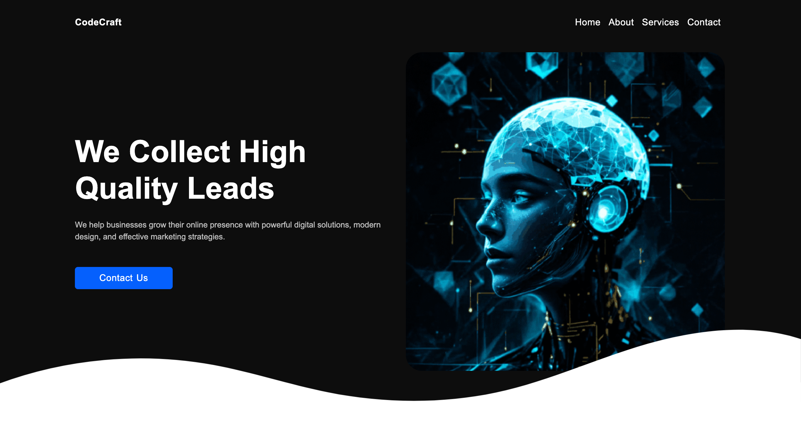
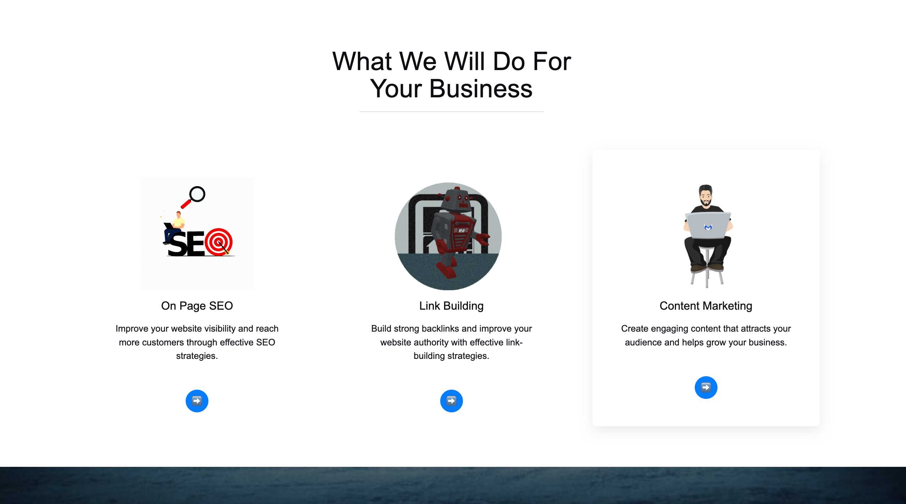
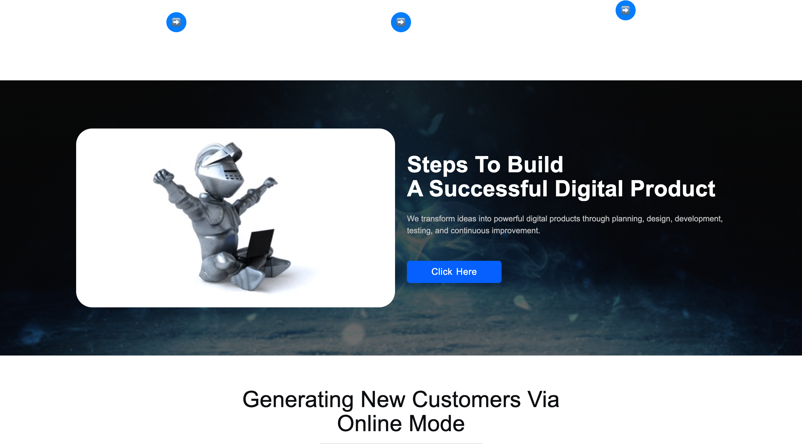
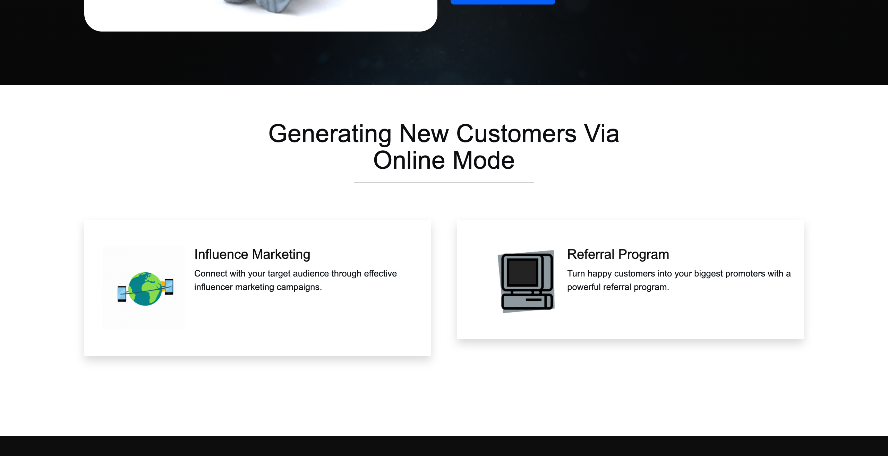

# 🚀 CodeCraft

> A modern and responsive digital marketing website built with HTML, CSS, JavaScript, and Bootstrap 5.

CodeCraft is a responsive business website designed to showcase digital marketing and online business services. The project focuses on creating a clean, modern, and user-friendly interface using **Bootstrap 5** along with custom CSS.

## 🌐 Live Demo

🔗 **Live Website:**  
https://code-craft-jade-sigma.vercel.app/

## 📂 GitHub Repository

🔗 **GitHub:**  
https://github.com/Annu9111/Code_Craft

## 📸 Screenshots

### 🏠 Home / Hero Section



### 💼 Services Section



### 🚀 Digital Product Section



### 📊 Business Growth Section




---

## ✨ Features

- 📱 Fully responsive design
- 🎨 Modern and clean UI
- 🧭 Responsive Bootstrap navigation bar
- 🦸 Attractive hero section
- 💼 Digital marketing services section
- 📈 Business growth section
- 💬 Client testimonials section
- 🎞️ Animated GIF illustrations
- 🔘 Bootstrap buttons and tooltips
- 🌊 Custom SVG wave section dividers
- 📐 Responsive layouts using Bootstrap grid
- ⚡ Fast and lightweight static website
- 🌐 Deployed using Vercel

---

## 🛠️ Technologies Used

### Frontend

- HTML5
- CSS3
- Bootstrap 5.3.8
- JavaScript
- SVG

### Deployment

- GitHub
- Vercel

---

## 📁 Project Structure

```text
Code_Craft/
│
├── css/
│   ├── style.css
│   └── media.css
│
├── images/
│
├── videos/
│
├── js/
│
├── index.html
│
└── README.md
